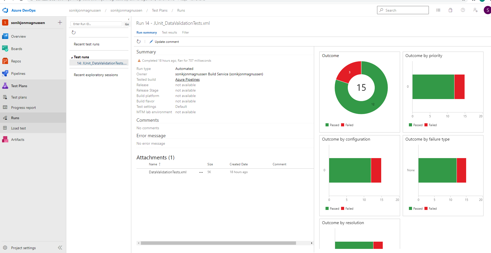
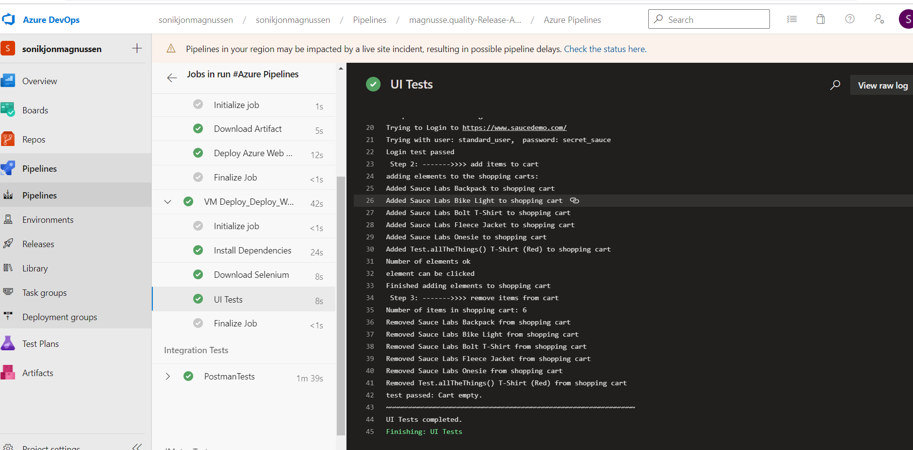

# quality-Release-AzureDevOps-Udacity

## project 3 for the Azure devops nanodegree

This project consists of:
* terraform infrastructure declaration including
 * Service App to host a small web application (fakerestapi)
 * virtual machine (Linux) for hosting a UI tests
* automatedtesting suite for the following TestReports
 * UI test with selenium on python
 * postman integration test
 * jmeter stress and endurance tests

The project is orchestrated by an Azure Devops pipeline YAML file which contructs the interfaces, deploys the software and the tests and finally runs all tests. Please finde screenshots of all relevant infos and results in the screenshot folder.

* Result of an entire run of pipeline
&nbsp;
  
&nbsp;

* Entire pipeline after run
&nbsp;
  
&nbsp;

* Result overview of integration tests with Postman
&nbsp;
  
&nbsp;

&nbsp;
  
&nbsp;

* detailed testcases postman in the detailed pipeline view (outputs)
&nbsp;
  
&nbsp;

* Results in the detailed pipeline view (outputs)
&nbsp;
  
&nbsp;

* UItests with selenium and python -- results
&nbsp;
  
&nbsp;

* Endurance and Stress tests with jmeter - successful run pipeline
&nbsp;
  
&nbsp;

* Jmeter testresults report
&nbsp;
  
&nbsp;

&nbsp;
  
&nbsp;

&nbsp;
  
&nbsp;

* The Alert email from Azure monitoring
&nbsp;
  
&nbsp;

* The Monitor and the rule
&nbsp;
  
&nbsp;

&nbsp;
  
&nbsp;

* The rule
&nbsp;
  
&nbsp;

* The Alerts
&nbsp;
  
&nbsp;

*
